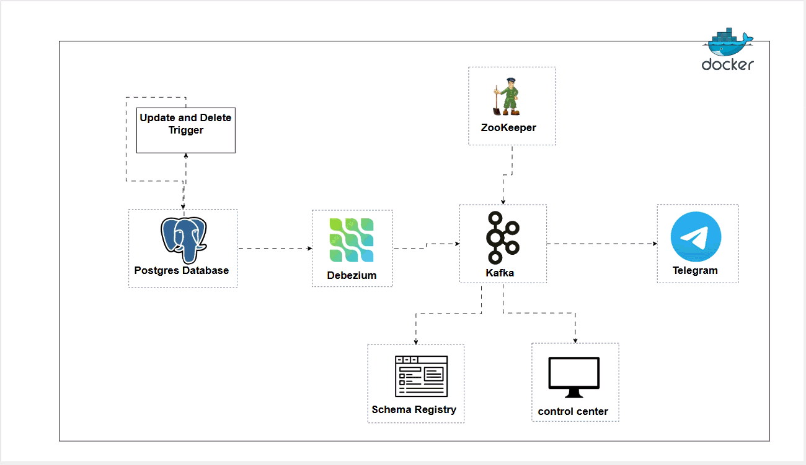

# 🧩 Real-time CDC pipeline with Postgres Kafka Telegram

A **real-time change data capture (CDC)** pipeline using **Debezium**, **Kafka**, and **PostgreSQL** to stream database changes and send alerts via **Telegram**.  
The project also includes a **PostgreSQL trigger-based audit log** that captures detailed change context such as username, IP address, and client application — providing both real-time monitoring and forensic auditing capabilities.

---

## 🏗️ Architecture Overview




**Components:**
- **PostgreSQL** — source database
- **Debezium** — captures changes from Postgres WAL
- **Kafka** — transports CDC events
- **Schema Registry** & **Control Center** — manage schemas and monitor pipelines
- **Docker** — container orchestration
- **Telegram Bot** — receives change notifications
- **Custom Postgres Trigger** — creates detailed audit trail


---

## ⚙️ Tech Stack

| Component | Description |
|------------|--------------|
| PostgreSQL | Main source database |
| Debezium | CDC connector capturing row-level changes |
| Kafka | Event streaming backbone |
| Docker | Service containerization |
| Schema Registry & Control Center | Schema management & Kafka monitoring |
| PostgreSQL Trigger | Local audit logging |
| Telegram Bot | Notification endpoint |

---

## ✨ Features

- Captures and streams **update** and **delete** events in real-time  
- Sends formatted **alerts to Telegram** via bot API  
- Uses a **Postgres trigger** to maintain an internal **audit trail** with:
  - Username
  - Client application name
  - IP address
  - Before/after state
  - JSON diff of changes  

---

## 🚀 Setup & Installation

### 1. Clone the project
```bash
git clone https://github.com/zalihat/real-time-CDC-pipeline-with-postgres-kafka-telegram.git

cd real-time-CDC-pipeline-with-postgres-kafka-telegram

```
### 2. Build Kafka Connect image
```
docker buildx build --platform linux/amd64 -t cdcraft/kafka-connect:latest ./kafka-connect --load
```

### 3. Start services
```
docker compose up -d
```
This starts:

* PostgreSQL: 

* Kafka Broker & Zookeeper

* Schema Registry

* Kafka Connect

* Control Center

### 🗄️ Create a Test Database
```
CREATE TABLE public.sales_test (
  id SERIAL PRIMARY KEY,
  customer_name TEXT,
  item TEXT,
  amount NUMERIC(10,2),
  updated_at TIMESTAMPTZ DEFAULT NOW()
);

-- Include full row in WAL for updates/deletes
ALTER TABLE public.sales_test REPLICA IDENTITY FULL;

```
### 🔗 Configure Debezium Source Connector
```curl -i -X POST -H "Accept:application/json" -H "Content-Type:application/json" \
  localhost:8083/connectors/ -d '@./connectors/source.json'
  ```

### 🧾 Create the Audit Schema
```
CREATE SCHEMA IF NOT EXISTS audit;

CREATE TABLE IF NOT EXISTS audit.data_changes (
  audit_id     bigserial PRIMARY KEY,
  table_name   text NOT NULL,
  record_pk    text,
  op_type      text NOT NULL,
  changed_by   text,
  app_name     text,
  client_ip    inet,
  changed_at   timestamptz DEFAULT now(),
  before_row   jsonb,
  after_row    jsonb,
  diff         jsonb
);
```
### 🧩 Create the Audit Function and Trigger
```
CREATE OR REPLACE FUNCTION audit.log_row_change() RETURNS trigger AS $$
DECLARE
  pk_val text;
  before_json jsonb;
  after_json jsonb;
  computed_diff jsonb := '{}'::jsonb;
BEGIN
  IF TG_OP = 'DELETE' THEN
    before_json := row_to_json(OLD)::jsonb;
    after_json := NULL;
    pk_val := OLD.id::text;
  ELSIF TG_OP = 'INSERT' THEN
    before_json := NULL;
    after_json := row_to_json(NEW)::jsonb;
    pk_val := NEW.id::text;
  ELSE
    before_json := row_to_json(OLD)::jsonb;
    after_json := row_to_json(NEW)::jsonb;
    pk_val := NEW.id::text;
  END IF;

  IF before_json IS NOT NULL AND after_json IS NOT NULL THEN
    computed_diff := (
      SELECT jsonb_object_agg(k, jsonb_build_object('old', before_json->k, 'new', after_json->k))
      FROM (
        SELECT jsonb_object_keys(before_json) AS k
        UNION
        SELECT jsonb_object_keys(after_json) AS k
      ) s
      WHERE (before_json->s.k) IS DISTINCT FROM (after_json->s.k)
    );
  END IF;

  INSERT INTO audit.data_changes(
    table_name, record_pk, op_type, changed_by, app_name, client_ip, before_row, after_row, diff
  )
  VALUES (
    TG_TABLE_NAME,
    pk_val,
    TG_OP,
    current_user,
    current_setting('application_name', true),
    inet_client_addr(),
    before_json,
    after_json,
    computed_diff
  );

  RETURN NEW;
END;
$$ LANGUAGE plpgsql;
```
### Create Trigger
```
CREATE TRIGGER trg_audit_sales_test
AFTER INSERT OR UPDATE OR DELETE
ON public.sales_test
FOR EACH ROW EXECUTE FUNCTION audit.log_row_change();

```
### 🧪 Test the CDC and Audit Log
```
INSERT INTO public.sales_test (customer_name, item, amount)
VALUES ('Alice', 'Laptop', 1200.00);

UPDATE public.sales_test
SET amount = 1800.00
WHERE customer_name = 'Alice';

SELECT * FROM audit.data_changes;
``` 

### 💬 Telegram Notifications

The Telegram consumer listens to Kafka events and sends alerts.

**Run the Python consumer:**
```
python telegram-consumer/kafka-telegram.py
```

This script:

* Connects to Kafka

* Filters UPDATE and DELETE events

* Sends formatted alerts to your Telegram chat

Example output (Telegram message):
``` 
🟡 *Record Updated*
ID: 2
🔸 amount: 3000.0 → 4000.0

``` 

### 🧹 Shutdown

After testing:

```
docker compose down
```

### 📁 Project Structure

real-time-CDC-pipeline-with-postgres-kafka-telegram/

├── connectors/

│  └── source.json

├── kafka-connect/

│   └── Dockerfile

├── telegram-consumer/

│   └── kafka-telegram.py

├── docker-compose.yml

└── README.md

### 🧠 Notes

* Only update and delete operations trigger Telegram alerts.

* The audit trigger logs all operations for compliance.
